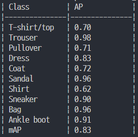
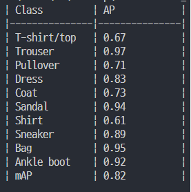
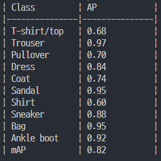

# 전처리

## Image to CSV
사진들을 csv 파일로 저장한다
```python
def count_images_in_folder(folder_path, valid_extensions=['.png']):
    image_count = 0
    for filename in os.listdir(folder_path):
        if any(filename.lower().endswith(ext) for ext in valid_extensions):
            image_count += 1
    return image_count

folder_path = '../Team_data/public_test_dataset/data/'
image_count = count_images_in_folder(folder_path)
print(f"Find {image_count} image")
```
추출할 사진들이 있는 폴더를 지정해주면 자동으로 .png 파일 개수를 새며 진행  

```python
IMAGE_NUM = 10000 #기존은 image_count
```
이렇게 상수를 직접 지정해주면 폴더 경로 입력 불필요

출력 형식은 기존 fashion-mnist dataset과 일치함이 보장됨 **(단, label 값은 모두 0이다)**


## Image augmentation

csv 파일을 읽고 데이터를 증강하여 csv파일로 저장

- 수정할만한 부분들
```python
target_labels = ["T-shirt/top", "Trouser", "Pullover", "Dress", "Coat",
    "Sandal", "Shirt", "Sneaker", "Bag", "Ankle_boot"] #본인이 증강을 원하는 대상 label로 구성
```

```python
image_generator = ImageDataGenerator(
            rotation_range=0,       # 회전 범위
            zoom_range=0.1,        # 확대/축소 범위
            shear_range=0,          # 변형(전단) 범위
            width_shift_range=0.1, # 가로 이동 범위
            height_shift_range=0.1,# 세로 이동 범위
            horizontal_flip=False,  # 수평 뒤집기
            vertical_flip=False)    # 수직 뒤집기

# 이 외에도 ImageDataGenerator는 다양한 파라미터를 지원

sample_size = 300 # 각 label마다 추출할 표본 개수
augment_size = 13 # 각 표본별 증강할 개수
```

# Report

**mAP 측정은 Public_test_dataset으로 진행**
- 기존 SVM mAP



- 증강된 이미지 9만개 mAP(약간의 일그러짐, 라벨 전부 증강)



- 증강된 이미지 9만개 mAP(상하좌우, 확대, 라벨 전부 증강)

